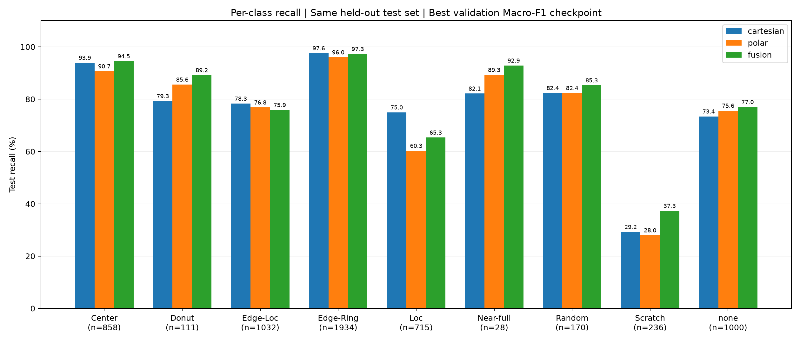

# 실제 실행 결과

단일 seed(42), MPS 실행. 검증 Macro-F1로 epoch를 선택한 후 동일 테스트 6,084장을 평가했습니다.

| 모델 | Accuracy | Macro-F1 | Macro Recall | 선택 epoch |
|---|---:|---:|---:|---:|
| cartesian | 83.68% | 0.7516 | 76.80% | 8 |
| polar | 81.21% | 0.7581 | 76.07% | 12 |
| fusion | 83.33% | 0.7807 | 79.40% | 11 |

결합 모델은 원본 대비 Macro-F1이 약 0.0291, Macro Recall이 약 2.60%p 높았습니다. 정확도는 약 0.35%p 낮았습니다. 검증 Macro-F1도 결합 모델(0.8001)이 원본(0.7984)보다 약간 높았습니다. 단일 실행의 작은 차이를 확정적 우위로 해석하지 마세요.

Donut Recall 79.28% → 89.19%, Scratch 29.24% → 37.29%. Loc Recall은 74.97% → 65.31%로 떨어졌습니다. Near-full은 82.14% → 92.86%지만 테스트 28장 중 23장 정답에서 26장 정답으로 바뀐 작은 표본입니다.

Fusion은 파라미터 약 164만 개로 원본 약 82만 개보다 많습니다. 추가 입력과 추가 모델 용량의 효과가 섞여 있습니다. 극좌표만 적용한 동일 크기 CNN은 정확도가 하락했고 Macro-F1은 소폭 상승했습니다.

이번 실험의 데이터 정제와 lot별 분할은 기존 노트북과 다르므로, 기존에 저장된 정확도와 직접 비교하지 마세요. 자세한 내용은 프로젝트 EXPERIMENT.md 및 config.json에 있습니다.